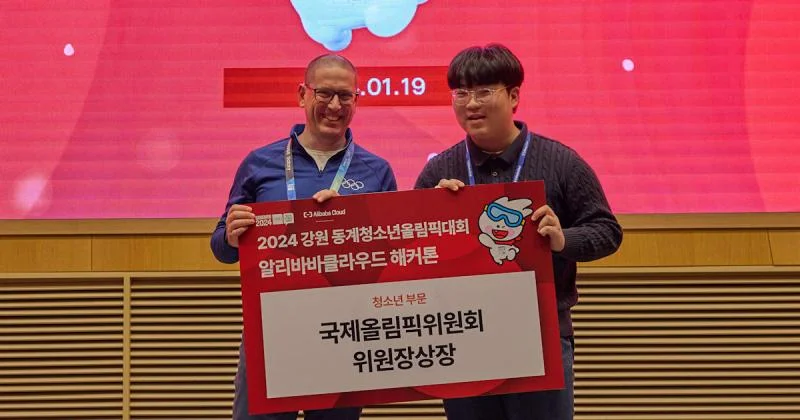
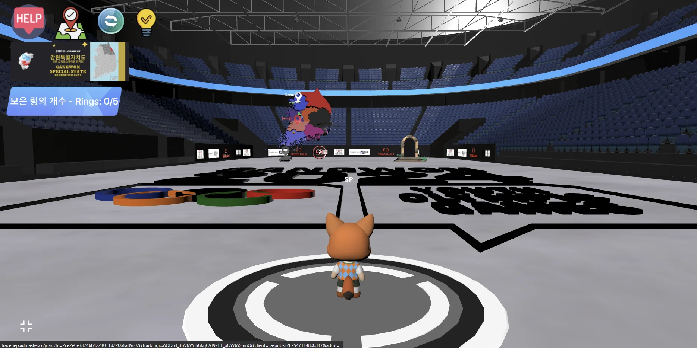
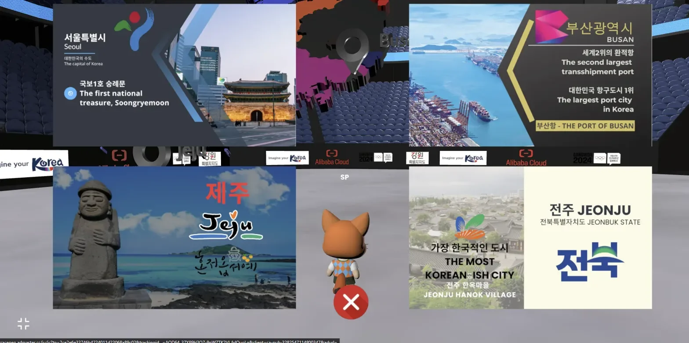
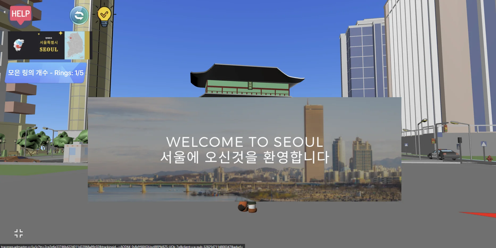
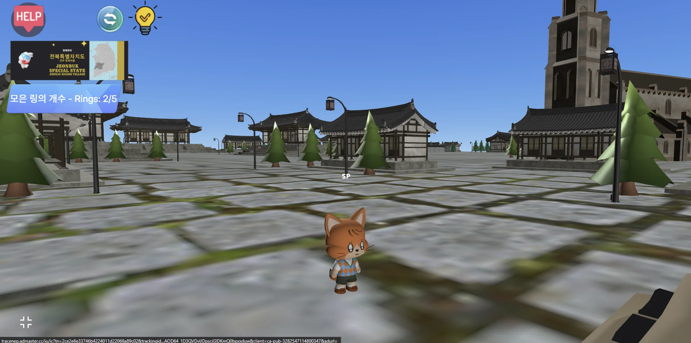
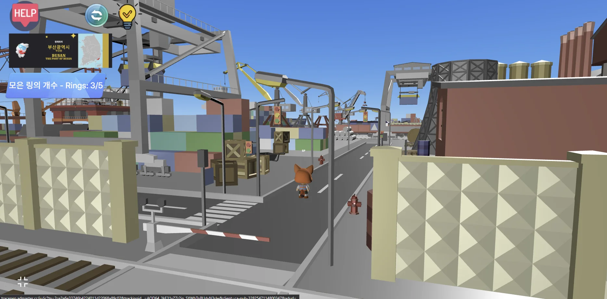
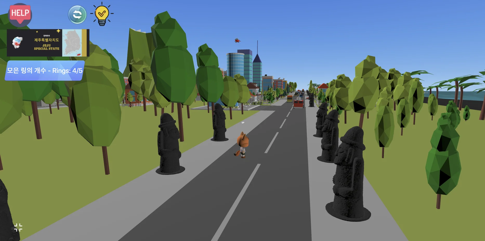
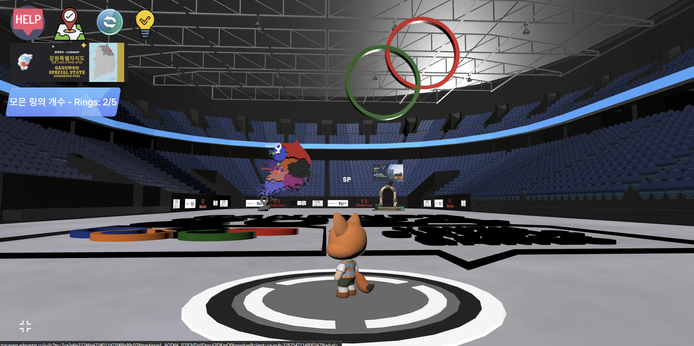
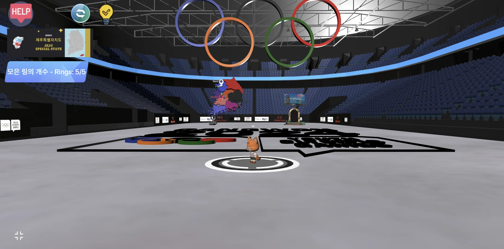

# 🏅 Olympic Spirit Quest

> **IOC President Award Winner** | 2024 Gangwon Winter Youth Olympics Alibaba Cloud Hackathon

An interactive 3D metaverse experience that takes players on a virtual tour of Korea, collecting Olympic rings hidden across four major cities while learning about Korean culture and landmarks.

[](https://redbrick.land/detail-play?pid=23345fd4-b0ae-434e-9e0c-1f50872cf943)
[](https://drive.google.com/file/d/1XKo4YhMxfbn7g5GX9v1Ft2KJfMfK1n48/view)
[](https://sites.google.com/gpa.ac.kr/completethe/home)

---

## 🏆 Recognition

<table>
<tr>
<td width="300">

</td>
<td>

**IOC President Award** —  
2024 Gangwon Winter Youth Olympic Games  
Alibaba Cloud Hackathon

**Press Coverage:**
- [Olympics.com Official Announcement](https://www.olympics.com/ioc/news/alibaba-cloud-hackathon-winners-announced-at-gangwon-2024)
- [Platum (Korean Tech News)](https://platum.kr/archives/221223)

</td>
</tr>
</table>

---

## 🎮 Gameplay

Players explore a virtual Korea, starting from the Gangwon Speed Skating Oval (the actual 2024 Youth Olympics venue). The objective is to find 5 Olympic ring fragments scattered across four Korean cities.

<table>
<tr>
<td align="center"><br/><b>Main Hub - Gangwon Oval</b></td>
<td align="center"><br/><b>City Selection UI</b></td>
</tr>
<tr>
<td align="center"><br/><b>Seoul - Gyeongbokgung Palace</b></td>
<td align="center"><br/><b>Jeonju - Hanok Village</b></td>
</tr>
<tr>
<td align="center"><br/><b>Busan - Port District</b></td>
<td align="center"><br/><b>Jeju - Dol Hareubang Statues</b></td>
</tr>
</table>

### Game Flow

```
┌─────────────────┐
│  Gangwon Oval   │ ← Start: Main Hub with Korea Map
│   (Main Hub)    │
└────────┬────────┘
         │ Select City via Portal
         ▼
┌─────────────────────────────────────────────┐
│                                             │
│  ┌─────────┐  ┌─────────┐  ┌─────────┐     │
│  │  Seoul  │  │  Busan  │  │  Jeju   │     │
│  │ 🔵 Ring │  │ 🟡 Ring │  │ 🔴 Ring │     │
│  └─────────┘  └─────────┘  └─────────┘     │
│                                             │
│  ┌─────────┐  ┌─────────────────────┐      │
│  │ Jeonju  │  │  Gangwon (Hidden)   │      │
│  │ ⚫ Ring │  │     🟢 Ring         │      │
│  └─────────┘  └─────────────────────┘      │
│                                             │
└─────────────────────────────────────────────┘
         │
         │ Collect All 5 Rings
         ▼
┌─────────────────┐
│   🎉 Ending     │ ← Olympic Theme Music + Completion Screen
│   Celebration   │
└─────────────────┘
```

<table>
<tr>
<td align="center"><br/><b>Ring Collection Progress (2/5)</b></td>
<td align="center"><br/><b>Quest Complete (5/5)</b></td>
</tr>
</table>

---

## 🛠 Technical Implementation

### Tech Stack

| Component | Technology |
|-----------|------------|
| Engine | [Redbrick](https://redbrick.land/) (Web-based 3D) |
| Language | JavaScript (450+ lines) |
| 3D Assets | Custom world composition using licensed assets |
| Platform | Browser-based (No installation required) |

### Core Systems

**1. State Machine for Location Tracking**
```javascript
var x = 0;  // Location state
// 0 = Gangwon (Hub), 1 = Seoul, 2 = Busan, 3 = Jeju, 4 = Jeonju

avatar.onCollide(portal1, () => {
    if (x === 1) avatar.go(1211.14, -263.43, 602.51);      // Seoul
    else if (x === 2) avatar.go(1299, 14.47, -1094.56);    // Busan
    else if (x === 3) avatar.go(-1328.15, 258.41, 150.63); // Jeju
    else if (x === 4) avatar.go(-1814.8, 932, 1861.44);    // Jeonju
});
```

**2. Collectible Ring System**
```javascript
var ali = 0;  // Ring count (0-5)

aliGreen.onClick(() => {
    ali++;
    aliGreen.kill();
    greenR.revive();  // Show collected ring in hub
    score.setText('모은 링의 개수 - Rings: ' + ali + '/5');
    checkAliAndKillTop();  // Check for game completion
});

function checkAliAndKillTop() {
    if (ali === 5) {
        avatar.spawn();
        olympic_theme.getAudio().play();
        setTimeout(showEnd, 5000);  // Victory sequence
    }
}
```

**3. Dynamic UI Management**
```javascript
function hideBasicGUI() {
    score.hide(); help.hide(); gangwonBasMap.hide(); 
    resetB.hide(); des.hide();
}

function showBasicGUI() {
    score.show(); help.show(); gangwonBasMap.show(); 
    resetB.show(); des.show();
}
```

### Key Features

| Feature | Description |
|---------|-------------|
| **Portal Teleportation** | Seamless travel between 5 distinct environments |
| **Progress Tracking** | Real-time ring collection counter (0/5 → 5/5) |
| **Hint System** | City-specific hints for finding hidden rings |
| **Bilingual UI** | Korean/English support throughout |
| **Dynamic Map** | Interactive Korea map showing current location |
| **Victory Sequence** | Olympic theme music + animated ring assembly |

---

## 🏙 Virtual Korea Tour

Each city features authentic Korean landmarks and cultural elements:

| City | Highlights | Cultural Significance |
|------|------------|----------------------|
| **Seoul** | Gyeongbokgung Palace, Modern Skyline | Capital city, blend of tradition and modernity |
| **Busan** | Port facilities, Industrial district | Korea's largest port, maritime hub |
| **Jeju** | Dol Hareubang statues, Coastal scenery | UNESCO Natural Heritage, volcanic island |
| **Jeonju** | Hanok Village, Traditional architecture | "Most Korean" city, traditional culture preservation |
| **Gangwon** | Speed Skating Oval | 2024 Winter Youth Olympics venue |

---

## 📁 Project Structure

```
olympic-spirit-quest/
├── README.md
├── src/
│   └── script.js          # Game logic (450+ lines)
└── docs/
    ├── award/
    │   └── ioc-president-award.png
    └── screenshots/
        ├── 01-goals-instructions.png
        ├── 02-main-hub-gangwon.png
        ├── ...
        └── 14-ending.png
```

---

## 🎯 Development Highlights

- **Solo Development**: Entire project conceptualized, designed, and implemented independently
- **3-Day Hackathon**: Built under time pressure during the official Olympic event
- **Cultural Research**: Accurate representation of Korean landmarks and cultural facts
- **User Experience**: Intuitive controls with bilingual instructions for international audience
- **Event Integration**: Seamlessly integrated with official 2024 Gangwon Youth Olympics branding

---

## 🔗 Links

| Resource | URL |
|----------|-----|
| 🎮 **Play the Game** | [Redbrick World](https://redbrick.land/detail-play?pid=23345fd4-b0ae-434e-9e0c-1f50872cf943) |
| 📺 **Demo Video** | [Google Drive](https://drive.google.com/file/d/1XKo4YhMxfbn7g5GX9v1Ft2KJfMfK1n48/view) |
| 📖 **Tutorial Website** | [Google Sites](https://sites.google.com/gpa.ac.kr/completethe/home) |
| 📰 **Olympics.com** | [Official Announcement](https://www.olympics.com/ioc/news/alibaba-cloud-hackathon-winners-announced-at-gangwon-2024) |
| 📰 **Platum** | [Korean Tech Coverage](https://platum.kr/archives/221223) |

---

## 📜 License

This project was created for the 2024 Gangwon Winter Youth Olympic Games Alibaba Cloud Hackathon.

- **Game Logic**: Original code by the author
- **3D Assets**: Licensed assets used with permission for world composition
- **Olympic Branding**: Used under official hackathon guidelines

---

## 👤 Author

**Seohyun Park**  
University of Waterloo, Computer Science  
Korea Presidential Science Scholarship Recipient

[](https://github.com/spbraden2007-ux)
[](https://linkedin.com/in/sp-park)
